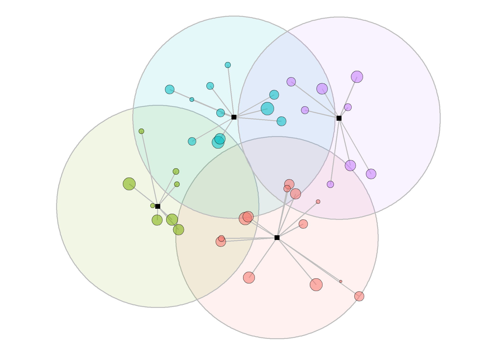
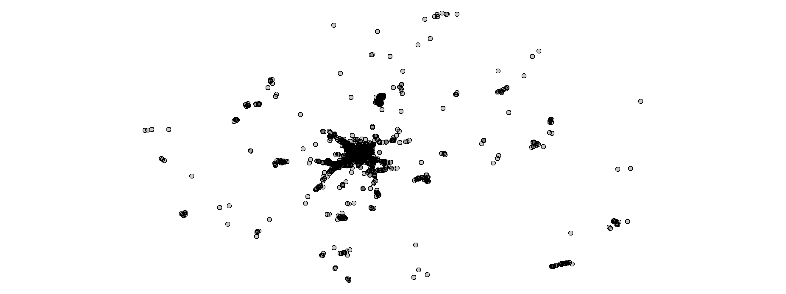

<!-- README.md is generated from README.Rmd. Please edit that file -->

# Zoning for Autonomous Vehicles

<!-- badges: start -->
<!-- badges: end -->

The goal of zav (Zoning for Autonomous Vehicles) is to show the
implementation of the problem instance generation and simulation
experiment conducted for the project.

## Installation

You can install the development version of zav from
[GitHub](https://github.com/) with:

``` r
# install.packages("devtools")
# note that there is a GitHub only dependency
# devtools::install_github("cuhklinlab/SWKM")
devtools::install_github("Rosenkrands/zav")
```

## Instance generation

To generate a problem instance we can utilize the `generate_2d_instance`
function.

``` r
library(zav)
library(ggplot2)
library(dplyr)
#> 
#> Attaching package: 'dplyr'
#> The following objects are masked from 'package:stats':
#> 
#>     filter, lag
#> The following objects are masked from 'package:base':
#> 
#>     intersect, setdiff, setequal, union

instance <- generate_2d_instance(no_of_points = 100)
# plot_point(instance = instance)
ggplot(instance$data) +
    geom_point(aes(x,y,size=`Arrival rate`),
                        shape = 21, fill = alpha("black", .2)) +
    theme_void()
```


## Zoning solutions

### Weighted K-Means

The below code chunk shows how we can utilize the `solve_wkmeans`
function to generate a solution for our problem instance.

``` r
solution_wkm <- solve_wkmeans(instance, no_of_centers = 5, type = "swkm")
plot_bases(solution = solution_wkm)
```


### Genetic Algorithm

The below chunk shows how we can utilize the `solve_ga` function to
generate a solution for our problem instance.

First we need to precalculate centroids to use as input for the GA.

``` r
centroids <- grid_centroids(instance, dimension = 5)
```

Having now the centroids and distances between demand points and
centroids, we are able to give this as input for the GA. As a default
the GA will have a maximum of 10 iterations for demonstration purposes,
in reality we would have a much higher number of iterations.

``` r
solution <- solve_ga(instance, centroids, no_of_centers = 5, obj = "SAFE")
```

``` r
plot_bases(solution)
```


## Simulation

Here it is shown how you can make a simulation based on the solution
just found:

``` r
#' The below line is for testing purposes
#' solution = solution; seed = 1;n_replications = 1;flight = "zoned";max_dist = 1000000;LOS = 600;warmup = 0;speed_agent = .25;verbose = F
simulation_result <- simulation(
  solution = solution_wkm,
  seed = 1,
  n_replications = 1,
  flight = "zoned",
  queue = T,
  max_dist = 1000000,
  LOS = 600,
  warmup = 0,
  speed_agent = .25,
  verbose = F
)
```

``` r
# simulation_result$metrics[[1]]$response_time_performance
```

``` r
simulation_result$metrics[[1]]$distances %>%
  ggplot(aes(x = time, 
             y = distance,
             color = paste0(id1,'-',id2))) +
  geom_line() +
  labs(color = "Pair") +
  theme(legend.position = "none")
```


### Free-flight/Soft zoning

As an argument to the simulation function we have `flight` that together
with the `max_dist` argument allow the user to obtain simulation results
from a “Free-flight” setup. Here we will give a brief introduction to
the concept.

If we set `fligth = "free"` and `max_dist` arbitrarily large any UAV
would be able to service any demand. This is what we would refer to as
free-flight.

However when any UAV can service any demand then mean response will
suffer from long travel distances. Therefore we propose using the
following scheme to decide on a maximum distance for the service area

r = dist<sub>max</sub> + *α* ⋅ number of UAVs

where *α* denotes the scaling factor and dist<sub>max</sub> denotes the
maximum distance between a demand point and its base location.

To further illustrate let us consider the following situation.

``` r
instance <- generate_2d_instance(no_of_points = 40)
solution <- solve_wkmeans(instance, no_of_centers = 4, type = "swkm")

plot_bases(solution) + coord_fixed()
```


We can the illustrate the service area for different values of *α* as
follows.



## Experiment Results

To get analyze the results from the experiment conducted for the project
we do the following.

``` r
results <- experiment_results()
```

``` r
results$solution <- results$solution %>% filter(`Number of UAVs` == "high")
results$simulation <- results$simulation %>% filter(`Number of UAVs` == "high")
```

The `results` variable is a list of 3 `tibbles` containing information
about instances, solutions and simulations respectively.

### Instances

If we take a look at the instances first we can see that there is a
total of 40 instances. These are distributed across the two arrival rate
variances as seen below.

``` r
results$instance |> 
  group_by(`Arrival rate distribution`, `Arrival rate variance`) |> 
  summarise(n = n())
#> # A tibble: 2 x 3
#> # Groups:   Arrival rate distribution [1]
#>   `Arrival rate distribution` `Arrival rate variance`     n
#>   <fct>                       <fct>                   <int>
#> 1 uniform                     low                        20
#> 2 uniform                     high                       20
```

### Solutions

Taking a look at the solutions we see that there are a total of 120
solutions. These are distributed across:

-   `Solution method` that have 3 levels: ga-safe, ga-tot, wkm-swkm.
    <!-- * `Number of UAVs` that have 1 levels: high. -->

#### Solution comparsion

If we start by comparing ga-tot and wkm-swkm we see that the latter is
able to outperform the first.


### Simulations

Looking at the simulation results we can see how the utilization is
affected by the queuing strategy. First we can take a look at the zoned
solution approach.


If we compare with the zoned solution approach with a free-flight
approach we see that the utilization go to 1 with the FCFS queue.

Looking at the simulation performance measures mean response and ploss,
given the no queue strategy, it would seem that we are giving up some
response time to lower the ploss for *α* = 0. But for other values of
*α* the performance are worse of overall.



Results are exaggerated for the FCFS queue strategy.


