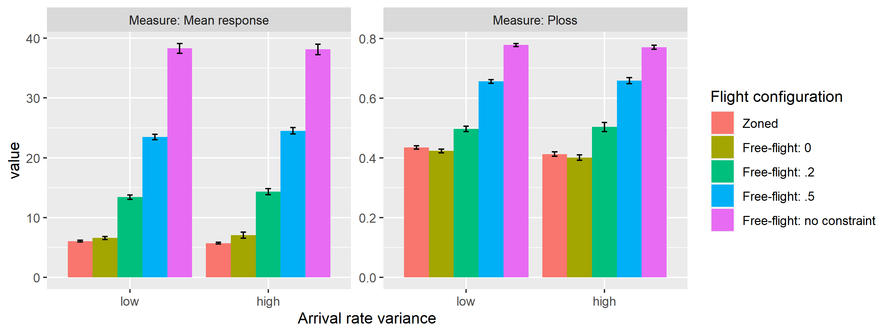
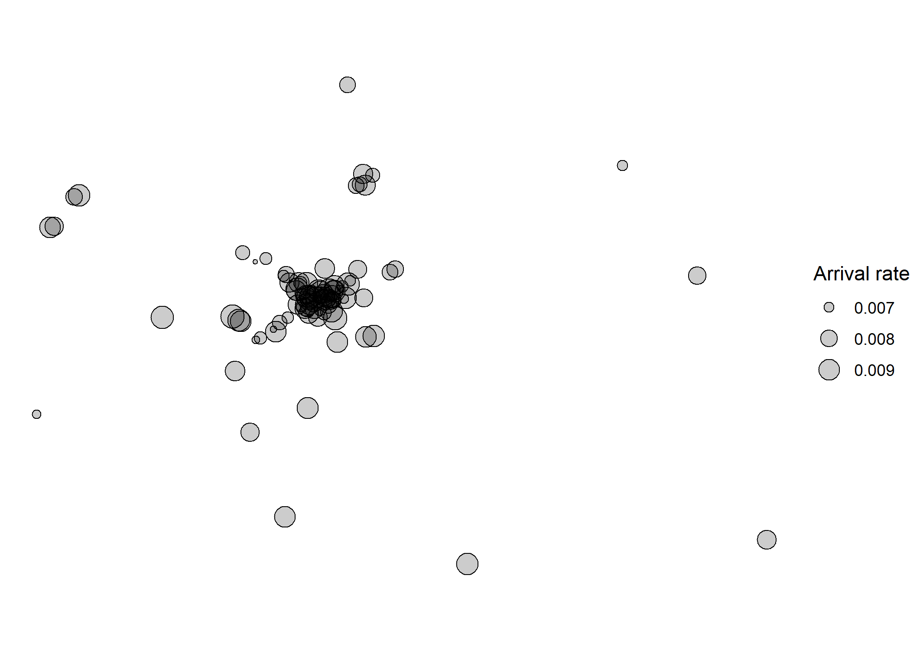
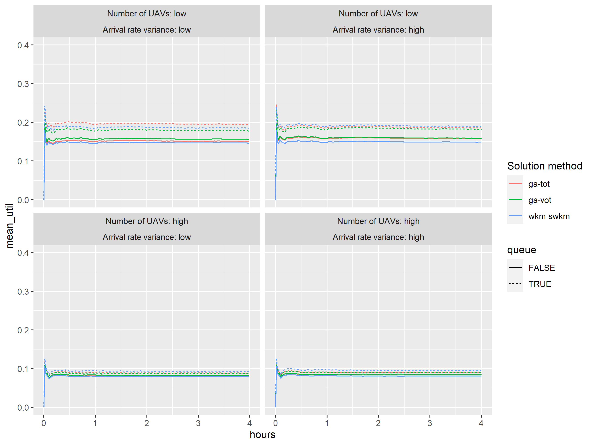
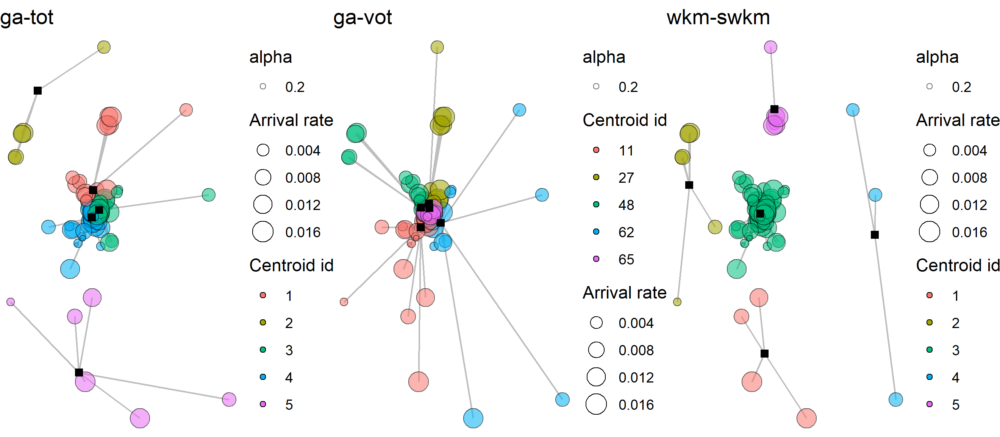
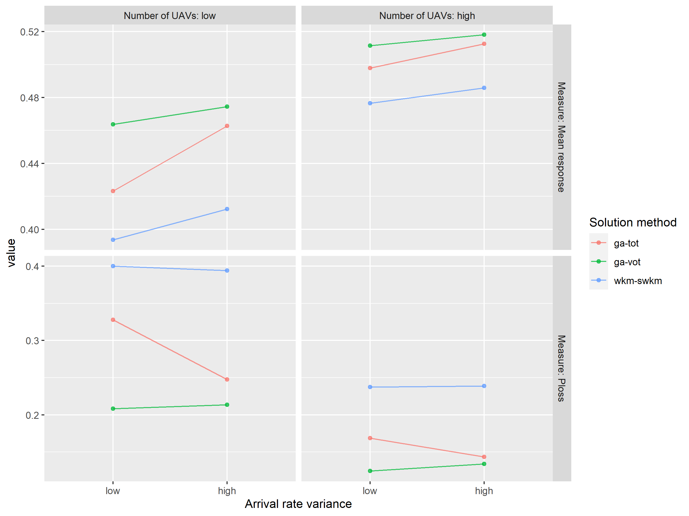
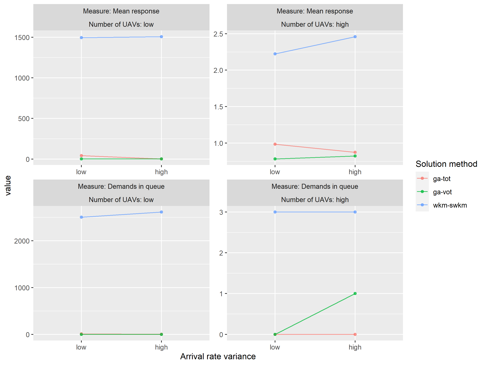
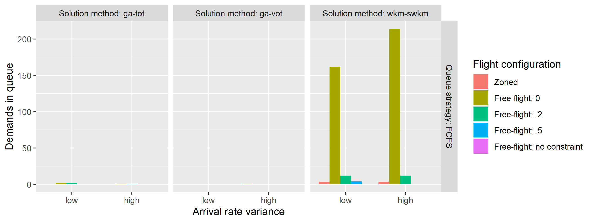

<!-- README.md is generated from README.Rmd. Please edit that file -->

# Zoning for Autonomous Vehicles

<!-- badges: start -->
<!-- badges: end -->

The goal of zav (Zoning for Autonomous Vehicles) is to show the
implementation of the problem instance generation and simulation
experiment conducted for the project.

## Installation

You can install the development version of zav from
[GitHub](https://github.com/) with:

``` r
# install.packages("devtools")
# note that there is a GitHub only dependency
# devtools::install_github("cuhklinlab/SWKM")
devtools::install_github("Rosenkrands/zav")
```

## Instance generation

To generate a problem instance we can utilize the `generate_2d_instance`
function.

``` r
library(zav)
library(ggplot2)
library(dplyr)
#> 
#> Attaching package: 'dplyr'
#> The following objects are masked from 'package:stats':
#> 
#>     filter, lag
#> The following objects are masked from 'package:base':
#> 
#>     intersect, setdiff, setequal, union

instance <- generate_2d_instance(no_of_points = 100)
# plot_point(instance = instance)
ggplot(instance$data) +
    geom_point(aes(x,y,size=`Arrival rate`),
                        shape = 21, fill = alpha("black", .2)) +
    theme_void()
```


## Zoning solutions

### Weighted K-Means

The below code chunk shows how we can utilize the `solve_wkmeans`
function to generate a solution for our problem instance.

``` r
solution_wkm <- solve_wkmeans(instance, no_of_centers = 5, type = "swkm")
plot_bases(solution = solution_wkm)
```


### Genetic Algorithm

The below chunk shows how we can utilize the `solve_ga` function to
generate a solution for our problem instance.

First we need to precalculate centroids to use as input for the GA.

``` r
centroids <- grid_centroids(instance, dimension = 5)
```

Having now the centroids and distances between demand points and
centroids, we are able to give this as input for the GA. As a default
the GA will have a maximum of 10 iterations for demonstration purposes,
in reality we would have a much higher number of iterations.

``` r
solution <- solve_ga(instance, centroids, no_of_centers = 5, obj = "SAFE")
```

``` r
plot_bases(solution)
```


## Simulation

Here it is shown how you can make a simulation based on the solution
just found:

``` r
#' The below line is for testing purposes
#' solution = solution_wkm; seed = 1;n_replications = 1;flight = "free";max_dist = 1000000;LOS = 600;warmup = 0;speed_agent = .25;verbose = F; dist_haversine = T
simulation_result <- simulation(
  solution = solution_wkm,
  seed = 1,
  n_replications = 1,
  flight = "zoned",
  queue = T,
  max_dist = 1000000,
  LOS = 600,
  warmup = 0,
  speed_agent = .25,
  verbose = F
)
```

``` r
# simulation_result$metrics[[1]]$response_time_performance
```

``` r
simulation_result$metrics[[1]]$distances %>%
  ggplot(aes(x = time, 
             y = distance,
             color = paste0(id1,'-',id2))) +
  geom_line() +
  labs(color = "Pair") +
  theme(legend.position = "none")
```


### Free-flight/Soft zoning

As an argument to the simulation function we have `flight` that together
with the `max_dist` argument allow the user to obtain simulation results
from a “Free-flight” setup. Here we will give a brief introduction to
the concept.

If we set `fligth = "free"` and `max_dist` arbitrarily large any UAV
would be able to service any demand. This is what we would refer to as
free-flight.

However when any UAV can service any demand then mean response will
suffer from long travel distances. Therefore we propose using the
following scheme to decide on a maximum distance for the service area

$\\\\text{r} = \\\\text{dist}\\\_\\\\text{max} + \\\\alpha \\\\cdot \\\\text{number of UAVs}$

where $\\\\alpha$ denotes the scaling factor and
$\\\\text{dist}\\\_\\\\text{max}$ denotes the maximum distance between a
demand point and its base location.

To further illustrate let us consider the following situation.

``` r
instance <- generate_2d_instance(no_of_points = 40)
solution <- solve_wkmeans(instance, no_of_centers = 4, type = "swkm")

plot_bases(solution) + coord_fixed()
```


We can the illustrate the service area for different values of
$\\\\alpha$ as follows.


## Experiment Results

To get analyze the results from the experiment conducted for the project
we do the following.

``` r
results <- experiment_results()
```

The `results` variable is a list of 3 `tibbles` containing information
about instances, solutions and simulations respectively.

### Instances

If we take a look at the instances first we can see that there is a
total of 40 instances. These are distributed across the two arrival rate
variances as seen below.

``` r
results$instance |> 
  group_by(`Arrival rate distribution`, `Arrival rate variance`) |> 
  summarise(n = n())
#> # A tibble: 2 x 3
#> # Groups:   Arrival rate distribution [1]
#>   `Arrival rate distribution` `Arrival rate variance`     n
#>   <fct>                       <fct>                   <int>
#> 1 uniform                     low                        20
#> 2 uniform                     high                       20
```

### Solutions

Taking a look at the solutions we see that there are a total of 120
solutions. These are distributed across:

-   `Solution method` that have 3 levels: ga-safe, ga-tot, wkm-swkm.
    <!-- * `Number of UAVs` that have 1 levels: high. -->

#### Solution comparsion

If we start by comparing ga-tot and wkm-swkm we see that the latter is
able to outperform the first.


### Simulations

Looking at the simulation results we can see how the utilization is
affected by the queuing strategy. First we can take a look at the zoned
solution approach.


If we compare with the zoned solution approach with a free-flight
approach we see that the utilization go to 1 with the FCFS queue.

Looking at the simulation performance measures mean response and ploss,
given the no queue strategy, it would seem that we are giving up some
response time to lower the ploss for $\\\\alpha = 0$. But for other
values of $\\\\alpha$ the performance are worse of overall.



Results are exaggerated for the FCFS queue strategy.


Looking at just the numbers we get for mean response the following
numbers for zoned and free-flight: no constraint.

| Solution method | Queue strategy | Measure       |      Zoned | Free-flight: no constraint |
|:----------------|:---------------|:--------------|-----------:|---------------------------:|
| wkm-swkm        | FCFS           | Mean response | 292.177967 |                   5640.588 |
| wkm-swkm        | No queue       | Mean response |   5.881527 |                     38.207 |

## Example with real data

To see how the methods presented apply to real data we include the
following section. From the R package `maxcovr` we found the York crime
data set. The distribution of points from the data set looks as follows.


We have sampled demand points from this data set, to mimic the original
distribution, and made solutions and simulations. The sample with
assigned arrival rates is displayed in the following figure.

``` r
# Read precalculated york solutions
clean_york <- function(york_solution) {
  if (grepl("GA", york_solution)) {
    solution <- readRDS(york_solution)

    solution$no_of_centers <- nrow(solution$centroids)

    solution$clusters <- solution$centroids %>%
      dplyr::mutate(`Cluster id` = dplyr::row_number())

    solution$instance <- solution$instance %>%
      dplyr::inner_join(solution$clusters %>% dplyr::select(-x,-y), by = "Centroid id") %>%
      dplyr::select(-`Centroid id`) %>%
      dplyr::mutate(`Centroid id` = as.character(`Cluster id`)) %>%
      dplyr::select(-`Cluster id`)

    return(solution)
  } else {
    return(readRDS(york_solution))
  }
}

york_solutions <- lapply(
  list.files("inst/extdata/york", full.names = T) %>% as.list(),
  clean_york
)

ggplot2::ggplot(york_solutions[[1]]$instance) +
  ggplot2::geom_point(ggplot2::aes(x,y, size = `Arrival rate`),
                      shape = 21, fill = ggplot2::alpha("black", .2)) +
  ggplot2::theme_void() + coord_fixed()
```



``` r
ggsave("york_sample_with_arrival_rate.pdf", width = 8, height = 3)
```

We obtain metadata in the following way.

``` r
# The results from the york data set are available here
york <- readRDS(system.file("extdata", "york_simulation_metadata.rds", package = "zav"))
```

When comparing the solution we can see that `wkm-swkm` achieve a lower
TOT objective as compared to `ga-tot`.


Comparing now utilization of UAVs in the simulations we see that with
low number of UAVs, low arrival rate variance and FCFS queue strategy we
have higher utilization with `ga-tot` as compared to `wkm-swkm`.



We believe this could be due to `ga-tot` having to base locations
sharing the dense part of the service area, where as `wkm-swkm` only
have one base location covering the dense part of the area.



To see how this affect the mean response for the zoned approach with no
queue we can take a look at the following figure.



Looking at the figure we conclude that in general we see shorter
response times for `wkm-swkm` but also a high Ploss when comparing to
`ga-tot`.

Next we can take a look at how introducing a queue affects the findings.



First we notice that the winner in terms of mean response time have
shifted and we now see better performance for `ga-tot` as compared to
`wkm-swkm`. Looking at the demands in queue measure we also see better
performance for `ga-tot` as compared to `wkm-swkm`.

### Flight configurations

Having looked at the zoned approach with different queuing strategies,
this section will deal with the soft zoning strategies to see if they
can improve performance.

In the next figure we show how the mean response is affected by solution
method, queue strategy and arrival rate variance. We restrict to only
looking at high number of UAVs, the same pattern is true for low number
of UAVs but exaggerated in case of the FCFS queue.


In the case of having no queue, we see the same kind of pattern as from
the uniformly generated instances, here the zoned approach can achieve
the best mean response as it, by design, only chooses to service the
closest demands.

However this is not the case when introducing the queue, we suspect this
is because now the even distribution of demand between UAVs become
important as demands pile up in the queue a certain base is overworked.
This seems to be the case, in particular for the `wkm-swkm` solution
method where mean response for the zoned approach are much higher than
any of the free-flight configurations.

To further see the importance of balancing total arrival rate between
zones we can take a look at the demands in queue metric for the high UAV
case. Interestingly we have here that the free-flight: no constraint in
all situation are able to serve all demand, leaving no demand in queue
at the end of the simulation, where as for the `wkm-swkm` solution
method leaves demand in queue for all other flight configurations.



Lastly we can look at the Ploss for the no queue strategy.


This also shows that the only flight configuration that is able to serve
all demand is the free-flight: no constraint.

Even though we have seen here the good performance for free-flight: no
constraint, we would expect that this is also because of the low
utilization of UAVs overall in the system. Had there been more strain on
the system, then free-flight: no constraint would likely not have had
the time to fly the long distances and thus have served all demand. In
fact the ability to fly long distances to serve demand could be
detrimental to overall performance if the UAV does not take the distance
into consideration as part of the assignment policy.
