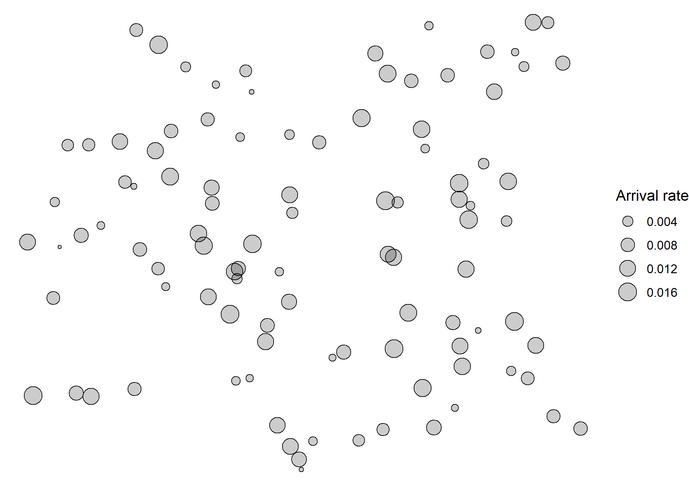
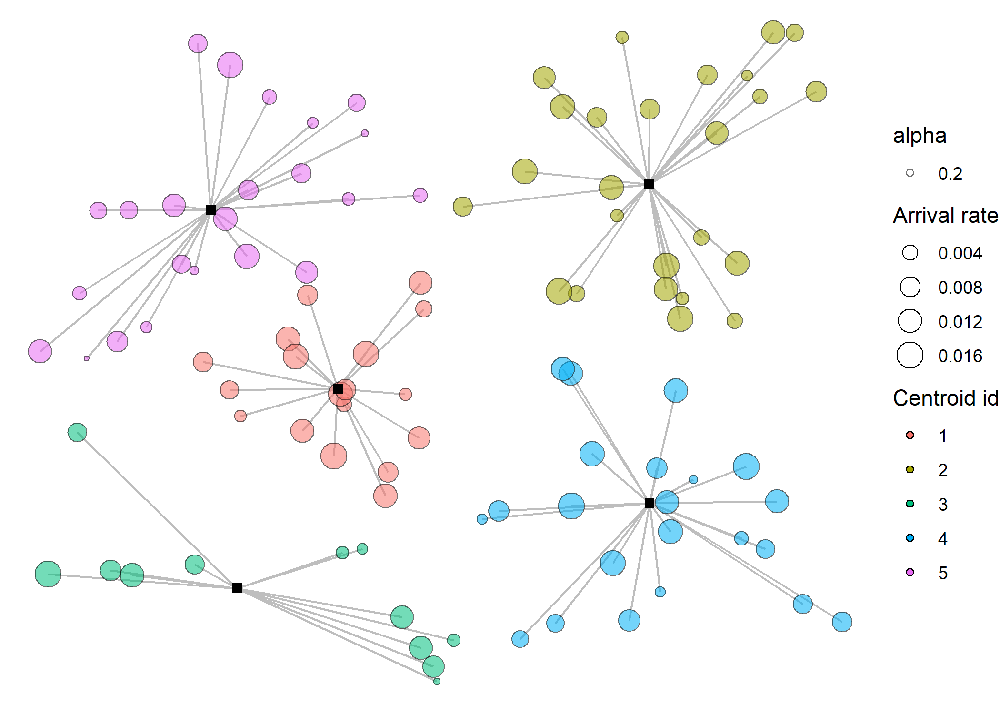
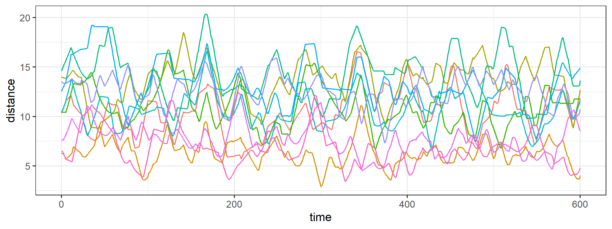

<!-- README.md is generated from README.Rmd. Please edit that file -->

# Zoning for Autonomous Vehicles

<!-- badges: start -->
<!-- badges: end -->

The goal of zav (Zoning for Autonomous Vehicles) is to show the
implementation of the problem instance generation and simulation
experiment conducted for the project.

## Installation

You can install the development version of zav from
[GitHub](https://github.com/) with:

``` r
# install.packages("devtools")
# note that there is a GitHub only dependency
# devtools::install_github("cuhklinlab/SWKM")
devtools::install_github("Rosenkrands/zav")
```

## Instance generation

To generate a problem instance we can utilize the `generate_2d_instance`
function.

``` r
library(zav)
library(ggplot2)

instance <- generate_2d_instance(no_of_points = 100)
# plot_point(instance = instance)
ggplot2::ggplot(instance$data) +
    ggplot2::geom_point(ggplot2::aes(x,y,size=`Arrival rate`),
                        shape = 21, fill = alpha("black", .2)) +
    ggplot2::theme_void()
```



## Zoning solutions

### Weighted K-Means

The below code chunk shows how we can utilize the `solve_wkmeans`
function to generate a solution for our problem instance.

``` r
solution_wkm <- solve_wkmeans(instance, no_of_centers = 5, type = "swkm")
plot_bases(solution = solution_wkm)
```



### Genetic Algorithm

The below chunk shows how we can utilize the `solve_ga` function to
generate a solution for our problem instance.

First we need to precalculate centroids to use as input for the GA.

``` r
centroids <- grid_centroids(instance, dimension = 5)
```

Having now the centroids and distances between demand points and
centroids, we are able to give this as input for the GA. As a default
the GA will have a maximum of 10 iterations for demonstration purposes,
in reality we would have a much higher number of iterations.

``` r
solution <- solve_ga(instance, centroids, no_of_centers = 5, obj = "SAFE")
```

``` r
plot_bases(solution)
```


## Simulation

Here it is shown how you can make a simulation based on the solution
just found:

``` r
#' The below line is for testing purposes
#' solution = solution; seed = 1;n_replications = 1;flight = "zoned";max_dist = 1000000;LOS = 600;warmup = 0;speed_agent = .25;verbose = F
simulation_result <- simulation(
  solution = solution_wkm,
  seed = 1,
  n_replications = 1,
  flight = "zoned",
  queue = T,
  max_dist = 1000000,
  LOS = 600,
  warmup = 0,
  speed_agent = .25,
  verbose = F
)
```

``` r
# simulation_result$metrics[[1]]$response_time_performance
```

``` r
simulation_result$metrics[[1]]$distances %>%
  ggplot(aes(x = time, 
             y = distance,
             color = paste0(id1,'-',id2))) +
  geom_line() +
  labs(color = "Pair") +
  theme_bw() +
  theme(legend.position = "none")
```



## Experiment Results

To get analyze the results from the experiment conducted for the project
we do the following.

``` r
results <- experiment_results()
```

The `results` variable is a list of 3 `tibbles` containing information
about instances, solutions and simulations respectively.

### Instances

If we take a look at the instances first we can see that there is a
total of 80 instances. These are distributed across the arrival rate
distributions and arrival rate variances as seen below.

``` r
results$instance |> 
  dplyr::group_by(`Arrival rate distribution`, `Arrival rate variance`) |> 
  dplyr::summarise(n = dplyr::n())
#> # A tibble: 4 x 3
#> # Groups:   Arrival rate distribution [2]
#>   `Arrival rate distribution` `Arrival rate variance`     n
#>   <fct>                       <fct>                   <int>
#> 1 uniform                     low                        20
#> 2 uniform                     high                       20
#> 3 unbalanced                  low                        20
#> 4 unbalanced                  high                       20
```

In the illustration below we can see the difference in arrival rate
distribution between the uniform and unbalanced distribution.


### Solutions

Taking a look at the solutions we see that there are a total of 480
solutions. These are distributed across:

-   `Solution method` that have 3 levels: ga-safe, ga-tot, wkm-swkm.
-   `Number of UAVs` that have 2 levels: high, low.

#### Solution comparsion

If we start by comparing ga-tot and wkm-swkm we see that the latter is
able to outperform the first, with the high number of UAVs.


Next we will check the similarity of total arrival rate for uniform and
unbalanced instances.

``` r
results$instance |> 
  dplyr::group_by(`Arrival rate distribution`) |> 
  dplyr::summarise(mean(`Total arrival rate`))
#> # A tibble: 2 x 2
#>   `Arrival rate distribution` `mean(\`Total arrival rate\`)`
#>   <fct>                                                <dbl>
#> 1 uniform                                             0.823 
#> 2 unbalanced                                          0.0953
```

The total arrival rate is not at all the same, so should maybe be
adjusted after looking at the simulation results!

### Simulations

work in progress…
